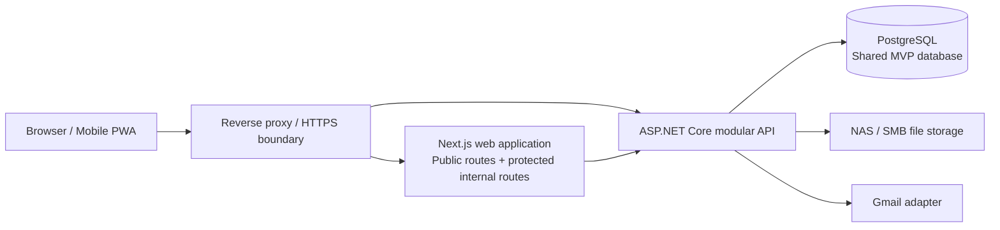
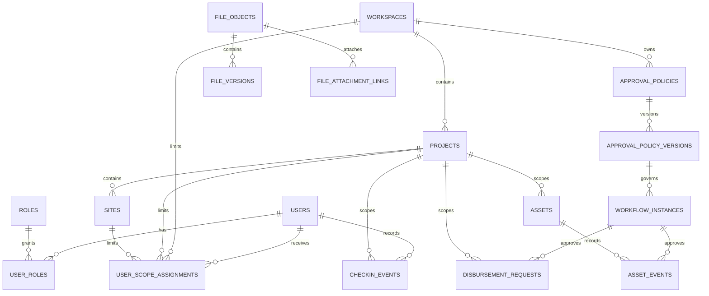

# TPR10 Module 0 Architecture Baseline Design

Date: 2026-09-18
Status: Proposed for user review

## 1. Purpose

This document defines the technical baseline for TPR10's internal
operational platform. It turns the approved module sequence into one
coherent architecture before implementation begins.

The current repository is a Next.js corporate landing page. The platform
described here adds an internal operational system without mixing protected
business data into public routes. Its MVP business modules are Online
Check-in, Field Disbursement, and Asset History. Authentication, scope
control, files, workflow, notification, and audit are shared platform
capabilities rather than separate MVP business modules.

This specification is authoritative for the new operational platform. The
older, historical authentication proposal for public content and sales users
does not define the roles, data model, or deployment of this platform.

### A–N baseline map

| Baseline area | This specification |
| --- | --- |
| A. Purpose and scope | Sections 1–2 |
| B. Architecture decisions and components | Sections 3–5 |
| C. Workspace/project isolation | Section 6 |
| D. Data/ERD baseline | Section 7 |
| E. Identity, permission, and audit | Section 8 |
| F. File storage | Section 9 |
| G. Workflow and notification | Section 10 |
| H. API convention | Section 11 |
| I. Online Check-in | Section 12 |
| J. Field Disbursement | Section 13 |
| K. Asset History | Section 14 |
| L. Deployment and operations | Section 15 |
| M. Delivery gates and production inputs | Sections 17–18 |
| N. Approval criteria | Section 19 |

## 2. Confirmed Product Constraints

- The MVP is for internal users. There is no self-registration, customer
  portal, social login, or native mobile application in this scope.
- The first three business modules are Online Check-in, Field Disbursement,
  and Asset History.
- The first identity provider is local username/password. The design must
  permit a future AD, LDAP, Entra ID, or Google provider without changing
  domain modules.
- MFA is mandatory for system administrators, approvers, accounting, and
  finance-data roles. It is configurable for other staff.
- A user may hold multiple roles and assignments across multiple projects
  and sites. Access is deny-by-default.
- Online Check-in is a Mobile Web/PWA experience. It must capture a
  real-time camera image, GPS, date, and time; file-picker image uploads are
  not permitted. Offline use requires a supervisor-approved grant scoped to
  a person, project or site, and time window.
- Field Disbursement supports Field Expense Advance, General Advance, and
  Expense Reimbursement. It uses sequential electronic approval, but MVP
  payment execution is recorded manual payment rather than a bank API.
- Asset History includes asset master data, categories, relationships,
  lifecycle events, restricted-event approvals, and optional images.
- Files are stored on an on-premises NAS through SMB using a service account;
  the database stores metadata, relationships, versions, and checksums.
- Initial external email is Gmail through an adapter. The deployment may use
  Gmail SMTP or the Gmail API without changing application-domain code.
- The initial operating environment is on-premises with LAN, VPN, internet,
  and mobile access protected by HTTPS, reverse proxy, and firewall rules.
- The existing public landing page remains available. Its development port is
  4000 and its production start port is 4001.

## 3. Architecture Decisions

| ID | Decision | Rationale |
| --- | --- | --- |
| AD-01 | Use a modular monolith for MVP: one operational API, one PostgreSQL deployment, and well-bounded domain modules. | It keeps delivery and operations manageable while preserving module boundaries for future extraction. |
| AD-02 | Keep the existing Next.js application as the web surface. Public and internal routes are separate route areas; protected operations never live in public page components. | This preserves the landing page and avoids an unnecessary frontend rewrite. |
| AD-03 | Use an ASP.NET Core API with PostgreSQL for protected business logic and data. | It separates client concerns from business authorization, workflow, audit, and NAS access. |
| AD-04 | Use the MVP deployment profile: Shared Back Office plus Shared Database. Every scoped business record carries an explicit workspace and project boundary. | This is the approved MVP profile; it is simpler to operate while maintaining strict logical isolation. |
| AD-05 | Prepare for a future Dedicated Back Office plus Dedicated Database profile, but do not implement a separate deployment in MVP. | Domain modules must not assume a permanent single-database topology. |
| AD-06 | Make access control a combination of role permissions and assignment scope. The API derives scope from the authenticated session and verifies every requested workspace, project, and site. | Hiding UI is not security; server-side authorization must control every sensitive read and mutation. |
| AD-07 | Treat workflow policies as versioned configuration. A submitted workflow instance is permanently bound to the policy version used at submission. | Approval changes must not rewrite the meaning or path of work already in progress. |
| AD-08 | Use an adapter boundary for NAS storage, email, identity providers, and future bank integration. | Business modules depend on stable application interfaces, not vendor-specific APIs. |
| AD-09 | Write audit events for security-sensitive and business-state changes in the same transaction or durable outbox as the primary mutation. | An approved record without attributable history is not acceptable for this platform. |
| AD-10 | Define REST/JSON APIs from OpenAPI contracts under `/api/v1`. Mutations that can be retried by a PWA or payment operator use idempotency keys. | This supports a Next.js web client, a PWA, integration adapters, and reliable retries. |

## 4. Logical Architecture

The browser reaches both the web application and API through the same HTTPS
boundary. The reverse proxy is the only public entry point. The API is the
only component allowed to access PostgreSQL, NAS credentials, Gmail
credentials, and business authorization rules.

The web application may render public marketing pages without an operational
session. Internal routes require a valid session and display only navigation
that the active user can access. The API repeats every authorization decision
for its own endpoint and data operation.

## 5. Module Boundaries

| Module | Owns | Depends on |
| --- | --- | --- |
| Identity and Access | accounts, local credentials, MFA enrollment, sessions, roles, permissions, offboarding | Audit, Notification |
| Organization and Scope | workspace, department, project, site, membership, role and site assignment | Identity and Access |
| File and Attachment | file object metadata, versions, checksums, attachment links, NAS adapter | Identity and Access, Organization and Scope, Audit |
| Workflow and Approval | policy definitions, immutable policy versions, approval steps, workflow instances, actions | Identity and Access, Organization and Scope, Notification, Audit |
| Notification | durable outbox, templates, email adapter, delivery attempts | Identity and Access, Audit |
| Online Check-in | attendance events, capture metadata, offline grants, correction requests | Identity and Access, Organization and Scope, File and Attachment, Workflow and Approval, Audit |
| Field Disbursement | requests, line items, advances, settlements, manual payment records | Identity and Access, Organization and Scope, File and Attachment, Workflow and Approval, Audit |
| Asset History | assets, categories, relationships, lifecycle events, restricted-event rules | Identity and Access, Organization and Scope, File and Attachment, Workflow and Approval, Audit |
| Reporting and Export | read models, export jobs, report permissions | All completed business modules, Audit |
| Administration and Compliance | retention policies, consent records, operational configuration, backup/restore records | Identity and Access, Audit, Notification |

No business module may directly read or write another module's tables. Cross-
module work occurs through application services and explicit interfaces. For
example, Field Disbursement creates a workflow instance through the Workflow
module rather than writing approval-step records itself.

## 6. Scope and Data-Isolation Model

### 6.1 MVP topology

MVP uses one controlled Back Office/API deployment and one PostgreSQL
database. It is not a cross-project data lake. The database contains a
workspace boundary and each business record belongs to a project when the
business process requires one.

`workspace` identifies the deployment/organizational isolation boundary.
`project` identifies an operational project within that workspace. `site` is
an optional child of a project. A user may be assigned to more than one
workspace/project/site only through explicit assignments.

### 6.2 Mandatory enforcement rules

1. Every business table has `workspace_id`; project-bound records also have
   `project_id`. Site-bound records additionally have `site_id`.
2. The API creates a `ScopeContext` from the authenticated session. Client
   input never grants a scope merely by naming an identifier.
3. Every list, detail, export, mutation, attachment, and workflow action
   verifies the caller's permission and assignment against `ScopeContext`.
4. Repositories accept a `ScopeContext` for scoped reads and writes. There is
   no default repository method that returns records across workspaces.
5. Composite foreign keys and indexes preserve workspace/project consistency;
   a record cannot reference a project from another workspace.
6. Audit events retain workspace, project, site, actor, action, correlation
   identifier, result, and timestamp.
7. Exports inherit the caller's current authorized scope and must record an
   audit event with filters, row count, and destination type.

### 6.3 Future topology path

The schema and APIs use stable UUID identifiers and no domain module assumes
that its data always shares a physical database with another workspace. A
future deployment registry can route a workspace to a dedicated API,
database, NAS namespace, credential set, backup policy, and network segment.

The MVP does not include cross-workspace reporting. Any future aggregate
report requires an explicit sanctioned export/read model rather than direct
cross-database operational queries.

## 7. Data Model Baseline

All primary identifiers are UUIDs. All mutable records use UTC timestamps;
the UI renders Asia/Bangkok time and the agreed Thai date format. A record
that has business lifecycle meaning includes `created_at`, `created_by`,
`updated_at`, `updated_by`, and a status or version field where applicable.

### 7.1 Shared foundation entities

| Area | Core entities |
| --- | --- |
| Scope | `workspaces`, `departments`, `projects`, `sites`, `user_scope_assignments` |
| Identity | `users`, `local_credentials`, `external_identities`, `roles`, `permissions`, `role_permissions`, `user_roles`, `mfa_factors`, `sessions`, `password_reset_requests` |
| Audit | `audit_events`, `audit_event_metadata` |
| Files | `file_objects`, `file_versions`, `file_attachment_links`, `storage_operations` |
| Workflow | `approval_policies`, `approval_policy_versions`, `approval_steps`, `workflow_instances`, `workflow_actions` |
| Notification | `notification_outbox`, `notification_deliveries`, `notification_templates` |
| Operations | `retention_policies`, `consent_acceptances`, `backup_restore_records` |

### 7.2 High-level ERD

The diagram intentionally shows ownership and scope rather than every column.
The implementation plan will translate this baseline into migrations with
concrete primary keys, foreign keys, unique constraints, indexes, and enum
values.

### 7.3 Online Check-in entities

- `checkin_events`: check-in/check-out event, workspace/project/site,
  effective time, server-received time, status, and actor.
- `checkin_captures`: file reference, GPS coordinates, accuracy, device
  capture time, capture mode (`online` or `offline`), checksum, and overlay
  version.
- `offline_checkin_grants`: approved person, project/site scope, start/end
  time, approving supervisor, reason, status, and audit relationship.
- `checkin_correction_requests`: original event, proposed correction, reason,
  workflow reference, and final resolution.

### 7.4 Field Disbursement entities

- `disbursement_requests`: request type, requester, project/site when
  relevant, requested amount, currency, workflow reference, and status.
- `disbursement_items`: expense or planned-use lines, amounts, dates,
  categories, and evidence requirements.
- `disbursement_settlements`: approved advance, actual expenditure, amount
  returned to company, amount owed to claimant, and settlement status.
- `manual_payment_records`: finance operator, transfer date, bank/reference
  identifier, amount, proof attachment, and reconciliation status.

### 7.5 Asset History entities

- `asset_categories`: controlled category hierarchy and active status.
- `assets`: asset identity, owner/scope, serial or tag identifiers, current
  state, and master attributes.
- `asset_relationships`: typed asset-to-asset relationships with effective
  dates.
- `asset_events`: lifecycle event, actor, time, state transition, details,
  optional attachment links, and workflow reference for restricted events.

### 7.6 Referential rules

- Attachments use generic links with a constrained owner type and owner UUID;
  the API validates that the owner belongs to the same scope.
- Workflow instances reference a business subject by module name and subject
  UUID. The subject's module remains the source of truth for its business
  status.
- Audit data is append-only to normal application roles. Corrections add a
  compensating event; they do not rewrite past audit history.
- A suspended user is not deleted. Historical records continue to reference
  the original user identity.

## 8. Identity, Authorization, and Audit

### 8.1 Authentication

The first provider is a local account with normalized username/password.
Accounts are created by authorized administrators; users cannot register
themselves. Password reset supports an email-based reset flow and an
administrator-issued reset that forces a password change on the next login.

The identity module exposes provider interfaces so a future provider can map
an external identity to the same internal `users` record. Domain modules only
use the internal user identifier and never depend on a provider-specific
claim.

Passwords use Argon2id hashes. Session tokens are cryptographically random,
stored in Secure, HttpOnly, SameSite cookies, and persisted only as hashes.
The API revokes active sessions when an account is disabled, a password is
reset, a role/assignment is removed, or an administrator performs a
sign-out-everywhere action.

### 8.2 MFA policy

MFA is required before a user can perform privileged actions when the user
holds any of these role classes: system administration, approval, accounting,
or finance-data access. Other staff can enroll when enabled by policy.
The API checks the MFA assurance state for privileged routes and workflow
actions; a visible page alone cannot bypass that check.

### 8.3 Authorization

Authorization evaluates all of the following before access is granted:

1. authenticated, active account;
2. required named permission;
3. MFA assurance when the route/action requires it;
4. workspace/project/site assignment and data-type scope;
5. field/detail visibility policy when applicable;
6. state-specific rule, such as whether the same person created a policy or
   request they are attempting to approve.

Permission checks use named capabilities such as `checkin:create`,
`disbursement:approve`, `asset:restricted-event`, `report:export`, and
`audit:read`. Role mappings are configuration data. Business code asks for a
capability, not for a hard-coded role name.

### 8.4 Audit contract

Each audit event records actor, acting role, scope, action type, target type,
target identifier, outcome, correlation ID, timestamp, and sanitized change
metadata. Audit events never contain plaintext passwords, session tokens,
full MFA secrets, or raw NAS/Gmail credentials.

## 9. File Storage and Attachment Contract

Browsers never receive SMB credentials and do not access NAS paths directly.
The File module verifies authorization, streams the upload through the API,
writes it to a controlled project namespace, calculates a checksum, records
file metadata, and then creates the business attachment link.

Each stored file has a stable `file_object` identity. New content creates a
`file_version` rather than overwriting historical evidence. The metadata
includes original filename, MIME type, byte size, checksum, uploader,
captured/uploaded time, storage provider, and logical namespace. Downloading
or viewing a file repeats the current authorization check and writes an audit
event.

The SMB adapter owns physical path construction and service-account access.
The rest of the application uses a `FileStorage` interface; future object
storage or a dedicated NAS can implement that interface without changing
business tables.

## 10. Workflow, Approval, and Notification Contract

An approval policy has a controlled lifecycle: draft, submitted for policy
approval, active, superseded, or retired. The policy creator cannot approve
their own policy change. Active policies are immutable versions.

When a business subject is submitted, the Workflow module selects one active
policy version using subject type, scope, amount/category conditions, and
other configured criteria. It materializes sequential approval steps in a
workflow instance. The instance retains the selected policy version even if a
new policy becomes active tomorrow.

An action is one of approve, reject, return-for-correction, cancel, or
escalate where the policy permits it. The API rejects self-approval, skipping
an incomplete prior step, duplicate action submission, and actions by users
outside the permitted scope.

Notifications are written to a durable outbox in the same transaction as the
business/workflow event. A background worker delivers email through the
configured Gmail adapter and records delivery attempts. A temporary Gmail
failure never changes the approved/rejected business outcome; it remains a
retryable notification operation visible to administrators.

## 11. API Baseline

The API uses versioned JSON endpoints under `/api/v1` and publishes an
OpenAPI document. Endpoints use problem-details responses for errors and a
correlation ID for operational diagnosis.

### 11.1 Endpoint groups

| Prefix | Responsibility |
| --- | --- |
| `/auth` | login, logout, password reset, MFA enrollment/challenge, session state |
| `/users`, `/roles`, `/permissions` | account and authorization administration |
| `/workspaces`, `/projects`, `/sites`, `/assignments` | scope administration |
| `/files` | upload, download, metadata, version and attachment operations |
| `/approval-policies`, `/workflows` | policy lifecycle and subject workflow actions |
| `/checkins` | online/offline check-in events, grants, corrections, sync |
| `/disbursements` | requests, items, settlements, manual payments |
| `/assets` | categories, assets, relationships, lifecycle events |
| `/reports`, `/exports` | authorized reports and asynchronous exports |
| `/admin` | retention, consent, health, backup/restore operational records |

### 11.2 API rules

- Every mutating request carries a correlation ID. Retryable mutations also
  carry an idempotency key scoped to the authenticated user and endpoint.
- Pagination is explicit and bounded. Unbounded list and export endpoints do
  not exist.
- The server calculates authorization scope before database access. A client
  may request a workspace/project/site but cannot select a scope it lacks.
- Request validation happens before business mutation. Validation failures do
  not write a partial business record.
- State transitions use optimistic concurrency/version fields or transaction
  locks so two approvers/operators cannot commit incompatible changes.
- OpenAPI descriptions identify the required permission, MFA requirement,
  relevant scope, request schema, response schema, and expected problem type.

## 12. Online Check-in Architecture

Online Check-in is implemented as a protected Mobile Web/PWA route. Its
camera flow uses browser camera APIs and does not expose a file-picker option.
The client draws GPS/date/time overlay content into the captured image and
sends the image plus raw capture metadata to the API. The API records both
device-reported and server-received times, validates the active assignment or
approved exception, stores the evidence through the File module, and creates
an immutable check-in/check-out event.

Offline use is disabled by default. A valid `offline_checkin_grant` is needed
before the client may queue an offline capture. The grant is checked against
the user, workspace/project/site, and start/end time before queueing and
again when syncing. The PWA queue preserves an idempotency key, capture
metadata, evidence checksum, and grant reference; it removes the queued item
after a successful final sync or an explicit user discard. The API records
the event as `offline` and audits both capture and sync.

Correction is a new request linked to the original event. It never edits the
original evidence or audit event in place.

## 13. Field Disbursement Architecture

Field Disbursement is one module with three typed request flows:

1. Field Expense Advance;
2. General Advance; and
3. Expense Reimbursement.

Each request has a typed state machine, supporting evidence, a workflow
instance, and a financial settlement view. The module computes approved
advance, actual expense, excess returned to company, and amount owed to the
claimant from immutable submitted/approved items and settlement actions.

MVP payment execution is manual: authorized finance staff record payment
date, amount, bank/reference identifier, and proof attachment after transfer
outside the application. The Bank Payment interface is present as a boundary
only; no bank credentials or automatic transfer workflow is introduced in
MVP.

## 14. Asset History Architecture

Asset History owns the asset master and lifecycle record. Asset categories
are managed reference data. Relationships are typed and effective-dated so an
asset can be associated with another asset, project, site, or parent
assembly without destroying previous history.

Lifecycle events include acquisition/registration, assignment, transfer,
installation, inspection, maintenance, repair, retirement, and return. A
restricted event is submitted through the Workflow module before it changes
the asset's effective state. Images are optional attachments linked to the
event; their metadata and access control follow the File module.

## 15. Deployment and Operational Baseline

### 15.1 Environments

- Local development runs the existing Next.js web application at port 4000.
- The production Next.js start command runs the web application at port 4001.
- The API, PostgreSQL, background worker, and NAS connector are private
  services. They are not exposed directly to the internet.
- A reverse proxy terminates HTTPS, sends public/internal web traffic to the
  Next.js application, and routes `/api` to the API service.

### 15.2 Production controls

- TLS certificates, database credentials, NAS service-account credentials,
  Gmail credentials, signing keys, and MFA secrets are held outside Git in a
  deployment secret store or protected environment configuration.
- Firewall rules allow only the reverse proxy to reach public clients; only
  the API/worker service account reaches PostgreSQL, NAS, and Gmail.
- Database backup, NAS backup, configuration backup, and secret metadata
  backup use multiple approved destinations with restore tests.
- A technical restore can be performed by a system administrator, but making
  recovered business data active requires the configured approval process.
- Monitoring covers API health, web health, storage availability, database
  capacity, failed notification deliveries, backup completion, and audit
  write failures.

## 16. Non-Goals for This MVP Baseline

- Native mobile application.
- Customer/partner self-service portal.
- Automatic bank transfer or bank API credentials.
- Deployment Profile 3 (dedicated Back Office and dedicated database).
- Cross-workspace operational queries or aggregate dashboards.
- Direct browser access to NAS/SMB.
- Public landing-page contact form integration with the internal workflow
  system. That integration is a separate, explicitly scoped change.

## 17. Delivery Order and Exit Gates

| Stage | Deliverable | Exit gate |
| --- | --- | --- |
| Module 0 | approved architecture, ERD baseline, API contract conventions, deployment/security baseline | user approves this design and the accompanying implementation plan |
| Module 1 | API/web/database foundation and health checks | authenticated service can read/write a scoped test record with migrations and audit |
| Module 2 | identity, sessions, MFA policy, RBAC | privileged and unprivileged route tests prove deny-by-default behavior |
| Module 3 | workspace/project/site assignment scope | cross-scope read/write/export attempts are rejected and audited |
| Module 4 | files/NAS adapter | upload, download, version, checksum, and scope checks pass |
| Module 5 | versioned workflow and notification outbox | maker-checker, sequential approval, policy version binding, and retry behavior pass |
| Module 6 | Online Check-in pilot slice | camera-only online flow, offline grant/sync, correction, and audit pass on mobile browser |
| Module 7 | Field Disbursement pilot slice | all three flows, evidence, sequential approval, settlement, and manual payment proof pass |
| Module 8 | Asset History pilot slice | lifecycle, restricted event approval, relationship, and optional image tests pass |
| Module 9 | reporting/admin/compliance | scoped export, retention, consent, backup/restore record, and system health checks pass |
| Module 10 | pilot and rollout | UAT sign-off, security review, operational runbook, training, and pilot acceptance complete |

Every implementation task must follow a red/green test cycle, verify lint and
production builds, and preserve the public landing-page behavior. Each module
receives a separate detailed implementation plan and review gate before code
is written.

## 18. Production Inputs Required Before Go-Live

The architecture is complete without embedding operational secrets. Before a
production release, the authorized operational owners provide these values in
deployment configuration and controlled policy data:

- canonical HTTPS hostnames and certificate management owner;
- PostgreSQL, NAS, and Gmail service credentials through the secret store;
- the selected Gmail adapter mode allowed by the organization's Google policy;
- initial administrators, role assignments, project/site assignments, and
  mandatory-MFA role classes;
- approved Field Disbursement policy thresholds and approver chains;
- pilot project/site and named pilot representatives;
- backup destinations, retention windows, restore approvers, and restore-test
  schedule.

These are operating parameters, not changes to the module architecture. They
must be auditable configuration or protected deployment data, never hard-coded
values in the repository.

## 19. Review Checklist

Approve this baseline when all of these statements are true:

1. The MVP uses a Shared Back Office plus Shared Database with enforced
   workspace/project scope and no default cross-project access.
2. The future dedicated deployment path is preserved without being included
   in MVP implementation.
3. The Next.js public landing page remains independent from internal business
   authorization and data.
4. ASP.NET Core, PostgreSQL, NAS/SMB, Gmail adapter, on-premises reverse
   proxy, and the modular-monolith boundary are acceptable technical choices.
5. Identity, scope, files, workflow, audit, and notification are completed
   before the three business modules.
6. The API and database rules are sufficient to prevent authorization by UI
   hiding or client-provided scope alone.
7. Online Check-in, Field Disbursement, and Asset History constraints match
   the intended MVP behavior.
