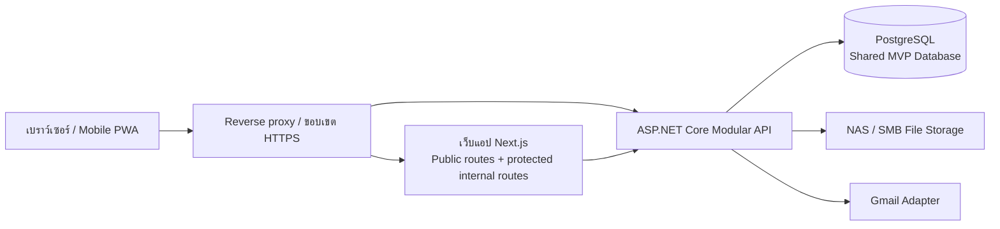
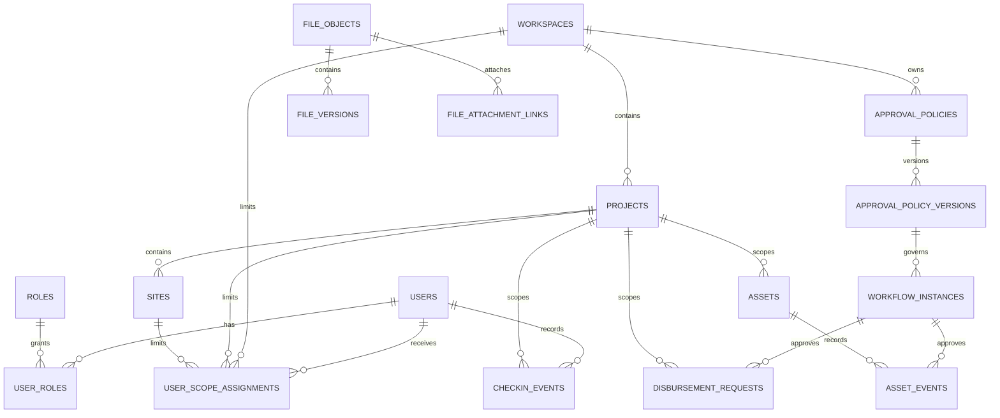

# เอกสารสถาปัตยกรรมพื้นฐาน Module 0 ของ TPR10

วันที่จัดทำ: 2026-09-18
แก้ไขล่าสุด: 2026-09-22
สถานะ: รอผู้ใช้ตรวจทาน
ภาษาเอกสาร: ภาษาไทย โดยคงชื่อเทคนิค, code, path, command และ identifier ที่จำเป็นเป็นภาษาอังกฤษ

## 1. วัตถุประสงค์

เอกสารนี้กำหนดสถาปัตยกรรมเชิงเทคนิคพื้นฐานสำหรับแพลตฟอร์มปฏิบัติการภายในของ TPR10 โดยเปลี่ยนลำดับการพัฒนาที่อนุมัติแล้วให้เป็นสถาปัตยกรรมเดียวที่สอดคล้องกัน ก่อนเริ่มพัฒนาระบบจริง

repository ปัจจุบันเป็น Corporate Landing Page ที่สร้างด้วย Next.js แพลตฟอร์มในเอกสารนี้จะเพิ่มระบบปฏิบัติการภายใน โดยไม่ผสมข้อมูลธุรกิจที่ต้องป้องกันเข้ากับเส้นทางสาธารณะ โมดูลธุรกิจของ MVP ได้แก่ Online Check-in, Field Disbursement และ Asset History ส่วน Authentication, การควบคุมขอบเขตข้อมูล, ไฟล์, Workflow, การแจ้งเตือน และ Audit เป็นความสามารถพื้นฐานร่วม ไม่ใช่โมดูลธุรกิจ MVP แยกต่างหาก

สเปกนี้เป็นเอกสารอ้างอิงหลักของแพลตฟอร์มปฏิบัติการใหม่ เอกสาร Authentication ในอดีตที่ออกแบบสำหรับผู้ใช้สายเนื้อหาและฝ่ายขายของเว็บไซต์สาธารณะ ไม่ได้กำหนด role, data model หรือ deployment ของแพลตฟอร์มนี้

### แผนที่ Baseline A–N

| หัวข้อ Baseline | ส่วนที่อ้างอิงในเอกสารนี้ |
| --- | --- |
| A. วัตถุประสงค์และขอบเขต | ส่วน 1–2 |
| B. การตัดสินใจและองค์ประกอบสถาปัตยกรรม | ส่วน 3–5 |
| C. การแยก Workspace/Project | ส่วน 6 |
| D. โมเดลข้อมูลพื้นฐานและ ERD | ส่วน 7 |
| E. ตัวตน สิทธิ์ และ Audit | ส่วน 8 |
| F. การจัดเก็บไฟล์ | ส่วน 9 |
| G. Workflow และการแจ้งเตือน | ส่วน 10 |
| H. มาตรฐาน API | ส่วน 11 |
| I. Online Check-in | ส่วน 12 |
| J. Field Disbursement | ส่วน 13 |
| K. Asset History | ส่วน 14 |
| L. Deployment และการปฏิบัติการระบบ | ส่วน 15 |
| M. เกณฑ์ผ่านงานและข้อมูลก่อนใช้งานจริง | ส่วน 17–18 |
| N. เกณฑ์การอนุมัติ | ส่วน 19 |
| เอกสารสนับสนุน | ส่วน 20: Decision Register และ Security/Pilot Acceptance Matrix |

## 2. ข้อจำกัดของผลิตภัณฑ์ที่ยืนยันแล้ว

- MVP ใช้สำหรับผู้ใช้ภายใน ไม่มีการสมัครสมาชิกเอง, customer portal, social login หรือ Native Mobile Application ในขอบเขตนี้
- โมดูลธุรกิจ 3 โมดูลแรกคือ Online Check-in, Field Disbursement และ Asset History
- Identity Provider แรกใช้ local username/password แต่การออกแบบต้องรองรับ AD, LDAP, Entra ID หรือ Google ในอนาคตโดยไม่ต้องแก้ domain module
- MFA เป็นข้อบังคับสำหรับ System Administrator, ผู้อนุมัติ, ฝ่ายบัญชี และ role ที่เข้าถึงข้อมูลการเงิน ส่วนพนักงานกลุ่มอื่นเปิดใช้ได้ตามนโยบาย
- ผู้ใช้หนึ่งคนมีหลาย role และหลาย assignment ข้ามหลาย project/site ได้ การเข้าถึงใช้หลัก deny-by-default
- Online Check-in เป็น Mobile Web/PWA ต้องถ่ายภาพจากกล้องแบบ real-time พร้อม GPS, วันที่ และเวลา ห้ามเลือกภาพจาก file picker การใช้งาน offline ต้องมี grant ที่หัวหน้าอนุมัติและผูกกับบุคคล, project หรือ site และช่วงเวลา
- Field Disbursement รองรับ Field Expense Advance, General Advance และ Expense Reimbursement ใช้การอนุมัติอิเล็กทรอนิกส์แบบลำดับขั้น แต่การจ่ายเงินใน MVP เป็นการบันทึก manual payment ไม่ใช่ Bank API
- Asset History มีข้อมูลสินทรัพย์หลัก, หมวดหมู่, ความสัมพันธ์, เหตุการณ์ตลอดวงจรชีวิต, การอนุมัติเหตุการณ์ที่ถูกจำกัด และภาพประกอบแบบ optional
- ไฟล์จริงเก็บใน NAS ภายในองค์กรผ่าน SMB ด้วย service account ส่วนฐานข้อมูลเก็บ metadata, ความสัมพันธ์, version และ checksum
- ผู้ให้บริการอีเมลภายนอกเริ่มต้นคือ Gmail ผ่าน adapter โดย deployment เลือก Gmail SMTP หรือ Gmail API ได้โดยไม่กระทบ domain code
- สภาพแวดล้อมแรกเป็น on-premises รองรับ LAN, VPN, internet และ mobile access ผ่าน HTTPS, reverse proxy และ firewall
- Public Landing Page เดิมต้องใช้งานได้ต่อไป โดย development ใช้ port 4000 และ production start ใช้ port 4001

## 3. การตัดสินใจด้านสถาปัตยกรรม

| ID | การตัดสินใจ | เหตุผล |
| --- | --- | --- |
| AD-01 | MVP ใช้ Modular Monolith: มี operational API เดียว, PostgreSQL deployment เดียว และ domain module ที่มีขอบเขตชัดเจน | ลดความซับซ้อนในการพัฒนาและดูแลระบบ ขณะยังคงขอบเขต module เพื่อแยกออกได้ในอนาคต |
| AD-02 | คง Next.js application เดิมเป็น web surface โดยแยก route area ของ public และ internal ออกจากกัน งานปฏิบัติการที่ต้องป้องกันห้ามอยู่ใน public page component | รักษา Landing Page เดิมและไม่ต้อง rewrite frontend โดยไม่จำเป็น |
| AD-03 | ใช้ ASP.NET Core API กับ PostgreSQL สำหรับ business logic และข้อมูลที่ต้องป้องกัน | แยกความรับผิดชอบของ client ออกจาก authorization, workflow, audit และการเข้าถึง NAS |
| AD-04 | ใช้ MVP deployment profile: Shared Back Office + Shared Database ทุก business record ที่อยู่ใน scope ต้องมี workspace และ project boundary ที่ชัดเจน | เป็น profile ที่อนุมัติสำหรับ MVP ดูแลง่ายแต่ยังคง logical isolation อย่างเข้มงวด |
| AD-05 | เตรียมเส้นทางไปสู่ Dedicated Back Office + Dedicated Database ในอนาคต แต่ไม่สร้าง deployment แยกใน MVP | Domain module ต้องไม่ผูกกับ topology แบบฐานข้อมูลเดียวเป็นการถาวร |
| AD-06 | การควบคุมสิทธิ์ประกอบด้วย role permission และ assignment scope API สร้าง scope จาก authenticated session และตรวจทุก workspace, project และ site ที่ร้องขอ | การซ่อน UI ไม่ใช่ security ต้องบังคับ authorization ฝั่ง server ทุก sensitive read และ mutation |
| AD-07 | Approval Policy เป็น configuration แบบ versioned และ workflow instance ที่ส่งแล้วจะผูกกับ policy version นั้นถาวร | การเปลี่ยนนโยบายใหม่ต้องไม่เขียนทับความหมายหรือเส้นทางอนุมัติของงานเดิม |
| AD-08 | ใช้ adapter boundary สำหรับ NAS storage, email, identity provider และ Bank Integration ในอนาคต | Business module พึ่งพา application interface ที่เสถียร ไม่ผูกกับ vendor API |
| AD-09 | เขียน Audit Event ของ security-sensitive action และ business-state change ใน transaction เดียวกันหรือ durable outbox เดียวกับ mutation หลัก | รายการที่อนุมัติแล้วแต่ตรวจสอบที่มาไม่ได้ เป็นผลลัพธ์ที่ยอมรับไม่ได้สำหรับแพลตฟอร์มนี้ |
| AD-10 | API เป็น REST/JSON แบบ versioned ภายใต้ `/api/v1` และเผยแพร่ OpenAPI contract การ mutation ที่ PWA หรือ payment operator retry ได้ ต้องใช้ idempotency key | รองรับ Next.js web client, PWA, integration adapter และการ retry ที่เชื่อถือได้ |
| AD-11 | Browser ใช้ public origin เดียว และเรียก API ผ่าน `/api` ที่ reverse proxy ส่งต่อไป ASP.NET Core API เท่านั้น API เป็นผู้ออกและ revoke session cookie ส่วน Next.js ใช้ผล session check จาก API เพื่อควบคุมการนำทางของ internal route แต่ไม่เป็น authority ของ business authorization | ลดความเสี่ยงจาก CORS, split session authority และการเชื่อว่าการซ่อน route ฝั่งเว็บเป็นการป้องกันข้อมูล |
| AD-12 | ลำดับ Module 1–3 แยก foundation, identity และ scope ออกจากกันอย่างชัดเจน: Module 1 ยังไม่อ้างว่า authentication หรือ business scope เสร็จ, Module 2 พิสูจน์ identity/session/RBAC/MFA, และ Module 3 จึงพิสูจน์ scope operation กับการปฏิเสธข้าม scope | ทำให้ Exit Gate ไม่เรียกร้องความสามารถที่ยังไม่ได้สร้าง และป้องกันการประกาศว่า scoped access ปลอดภัยก่อนมี identity กับ assignment |
| AD-13 | ใช้ Decision Register และ Security/Pilot Acceptance Matrix เป็นแหล่งควบคุมการตัดสินใจด้าน policy และ operation ที่ต้องมี owner กับหลักฐานก่อนผ่าน module gate หรือ Go-Live โดยไม่บันทึก secret | ทำให้ค่าที่ต้องตัดสินใจภายหลังตรวจสอบย้อนหลังได้ และแยก configuration/หลักฐานออกจาก source code และ architecture principle |

## 4. สถาปัตยกรรมเชิงตรรกะ

เบราว์เซอร์เข้าถึงทั้ง web application และ API ผ่าน HTTPS boundary เดียวกัน Reverse proxy เป็น public entry point เพียงจุดเดียว API เป็น component เดียวที่ได้รับสิทธิ์เข้าถึง PostgreSQL, NAS credential, Gmail credential และ business authorization rule

Web application สามารถ render หน้า marketing สาธารณะโดยไม่ต้องมี operational session ส่วน internal route ต้องมี session ที่ถูกต้องและแสดงเฉพาะ navigation ที่ผู้ใช้เข้าได้ API ต้องตรวจ authorization ซ้ำในทุก endpoint และทุก data operation ของตนเอง

## 5. ขอบเขตของโมดูล

| โมดูล | สิ่งที่เป็นเจ้าของ | สิ่งที่พึ่งพา |
| --- | --- | --- |
| Identity and Access | account, local credential, MFA enrollment, session, role, permission, offboarding | Audit, Notification |
| Organization and Scope | workspace, department, project, site, membership, role assignment และ site assignment | Identity and Access |
| File and Attachment | file object metadata, version, checksum, attachment link และ NAS adapter | Identity and Access, Organization and Scope, Audit |
| Workflow and Approval | policy definition, immutable policy version, approval step, workflow instance และ action | Identity and Access, Organization and Scope, Notification, Audit |
| Notification | durable outbox, template, email adapter และ delivery attempt | Identity and Access, Audit |
| Online Check-in | attendance event, capture metadata, offline grant และ correction request | Identity and Access, Organization and Scope, File and Attachment, Workflow and Approval, Audit |
| Field Disbursement | request, line item, advance, settlement และ manual payment record | Identity and Access, Organization and Scope, File and Attachment, Workflow and Approval, Audit |
| Asset History | asset, category, relationship, lifecycle event และ restricted-event rule | Identity and Access, Organization and Scope, File and Attachment, Workflow and Approval, Audit |
| Reporting and Export | read model, export job และ report permission | Business module ที่เสร็จแล้วทั้งหมด, Audit |
| Administration and Compliance | retention policy, consent record, operational configuration และ backup/restore record | Identity and Access, Audit, Notification |

Business module ห้ามอ่านหรือเขียน table ของ business module อื่นโดยตรง งานข้าม module ต้องผ่าน application service และ interface ที่ระบุชัดเจน ตัวอย่างเช่น Field Disbursement ต้องสร้าง workflow instance ผ่าน Workflow module แทนการเขียน approval-step record ด้วยตนเอง

## 6. โมเดล Scope และการแยกข้อมูล

### 6.1 Topology ของ MVP

MVP ใช้ Back Office/API ที่ควบคุมได้หนึ่ง deployment และ PostgreSQL database หนึ่งชุด ระบบนี้ไม่ใช่ cross-project data lake ฐานข้อมูลมี workspace boundary และ business record ทุกตัวจะอยู่ใต้ project เมื่อ business process นั้นต้องอ้างอิง project

`workspace` คือขอบเขตการแยกระดับ deployment/องค์กร ส่วน `project` คือโครงการปฏิบัติการภายใน workspace นั้น `site` เป็น child ที่ optional ของ project ผู้ใช้จะเข้าถึงมากกว่าหนึ่ง workspace/project/site ได้ก็ต่อเมื่อมี assignment โดยชัดแจ้ง

### 6.2 กฎบังคับใช้

1. Business table ทุกตัวมี `workspace_id` และ record ที่ผูกกับ project มี `project_id` เพิ่มเติม ส่วน record ที่ผูกกับ site มี `site_id` เพิ่มเติม
2. API สร้าง `ScopeContext` จาก authenticated session ข้อมูลที่ client ส่งมาไม่สามารถมอบสิทธิ์ scope ได้เพียงแค่ระบุ identifier
3. ทุก list, detail, export, mutation, attachment และ workflow action ต้องตรวจ permission และ assignment ของผู้เรียกกับ `ScopeContext`
4. Repository รับ `ScopeContext` สำหรับ scoped read/write ไม่มี default repository method ที่คืน record ข้าม workspace
5. Composite foreign key และ index ต้องรักษาความสอดคล้องของ workspace/project เพื่อไม่ให้ record อ้าง project ของ workspace อื่น
6. Audit event เก็บ workspace, project, site, actor, action, correlation identifier, result และ timestamp
7. Export ใช้ authorized scope ปัจจุบันของผู้เรียกและต้องสร้าง audit event ที่มี filter, row count และ destination type

### 6.3 เส้นทาง Topology ในอนาคต

Schema และ API ใช้ UUID ที่คงที่ และไม่มี domain module ใดสมมติว่าข้อมูลของตนต้องอยู่ใน physical database เดียวกับ workspace อื่นเสมอ ในอนาคต deployment registry สามารถ route workspace ไปยัง API, database, NAS namespace, credential set, backup policy และ network segment ที่แยกเฉพาะได้

MVP ไม่รวม cross-workspace reporting รายงานรวมในอนาคตต้องใช้ sanctioned export/read model ที่ระบุชัดเจน ไม่ใช่ direct cross-database operational query

## 7. โมเดลข้อมูลพื้นฐาน

Primary identifier ทุกตัวเป็น UUID Record ที่แก้ไขได้ใช้ UTC timestamp ส่วน UI แสดงเวลา Asia/Bangkok และรูปแบบวันที่ภาษาไทยตามที่ตกลงกัน Record ที่มีความหมายตาม business lifecycle มี `created_at`, `created_by`, `updated_at`, `updated_by` และ status หรือ version field ตามความเหมาะสม

### 7.1 เอนทิตีพื้นฐานร่วม

| พื้นที่ | Core Entity |
| --- | --- |
| Scope | `workspaces`, `departments`, `projects`, `sites`, `user_scope_assignments` |
| Identity | `users`, `local_credentials`, `external_identities`, `roles`, `permissions`, `role_permissions`, `user_roles`, `mfa_factors`, `sessions`, `password_reset_requests` |
| Audit | `audit_events`, `audit_event_metadata` |
| Files | `file_objects`, `file_versions`, `file_attachment_links`, `storage_operations` |
| Workflow | `approval_policies`, `approval_policy_versions`, `approval_steps`, `workflow_instances`, `workflow_actions` |
| Notification | `notification_outbox`, `notification_deliveries`, `notification_templates` |
| Operations | `retention_policies`, `consent_acceptances`, `backup_restore_records` |

### 7.2 ERD ระดับสูง

Diagram นี้แสดง ownership และ scope โดยตั้งใจ ไม่ได้แสดงทุก column Implementation plan จะเปลี่ยน baseline นี้เป็น migration ที่มี primary key, foreign key, unique constraint, index และ enum value ที่ชัดเจน

### 7.3 เอนทิตีของ Online Check-in

- `checkin_events`: เหตุการณ์ check-in/check-out, workspace/project/site, effective time, server-received time, status และ actor
- `checkin_captures`: file reference, GPS coordinate, accuracy, device capture time, capture mode (`online` หรือ `offline`), checksum และ overlay version
- `offline_checkin_grants`: ผู้ได้รับอนุมัติ, project/site scope, เวลาเริ่ม/สิ้นสุด, supervisor ผู้อนุมัติ, เหตุผล, status และ audit relationship
- `checkin_correction_requests`: เหตุการณ์เดิม, correction ที่เสนอ, เหตุผล, workflow reference และผลการพิจารณาสุดท้าย

### 7.4 เอนทิตีของ Field Disbursement

- `disbursement_requests`: request type, requester, project/site เมื่อเกี่ยวข้อง, requested amount, currency, workflow reference และ status
- `disbursement_items`: รายการค่าใช้จ่ายหรือแผนใช้เงิน, amount, date, category และ evidence requirement
- `disbursement_settlements`: approved advance, actual expenditure, amount ที่คืนบริษัท, amount ที่บริษัทต้องจ่าย และ settlement status
- `manual_payment_records`: finance operator, transfer date, bank/reference identifier, amount, proof attachment และ reconciliation status

### 7.5 เอนทิตีของ Asset History

- `asset_categories`: ลำดับชั้น category ที่ควบคุมและ active status
- `assets`: asset identity, owner/scope, serial หรือ tag identifier, current state และ master attribute
- `asset_relationships`: ความสัมพันธ์แบบมี type ระหว่าง asset พร้อม effective date
- `asset_events`: lifecycle event, actor, time, state transition, detail, optional attachment link และ workflow reference สำหรับ restricted event

### 7.6 กฎอ้างอิงข้อมูล

- Attachment ใช้ generic link ที่จำกัด owner type และ owner UUID โดย API ตรวจว่า owner อยู่ใน scope เดียวกัน
- Workflow instance อ้าง business subject ด้วย module name และ subject UUID โดย module เจ้าของ subject เป็น source of truth ของ business status
- Audit data เป็น append-only สำหรับ application role ทั่วไป การแก้ไขต้องเพิ่ม compensating event ไม่ใช่เขียนทับ audit history เดิม
- ผู้ใช้ที่ถูก suspend ไม่ถูกลบ Historical record ยังคงอ้างอิง user identity เดิมได้

## 8. ตัวตน การอนุญาต และ Audit

### 8.1 Authentication

Provider แรกเป็น local account ที่ใช้ normalized username/password Account ถูกสร้างโดย administrator ที่ได้รับสิทธิ์ ผู้ใช้สมัครเองไม่ได้ Password reset รองรับทั้ง email-based reset flow และ admin-issued reset ที่บังคับเปลี่ยน password ในการ login ครั้งถัดไป

Identity module เปิด provider interface เพื่อให้ provider ในอนาคต map external identity เข้ากับ `users` record ภายในตัวเดิมได้ Domain module ใช้เฉพาะ internal user identifier และไม่พึ่งพา provider-specific claim

Password ใช้ hash แบบ `Argon2id` Session token สุ่มด้วยวิธีเข้มแข็ง เก็บใน Secure, HttpOnly, SameSite cookie และบันทึกในฐานข้อมูลเป็น hash เท่านั้น API ต้อง revoke active session เมื่อ account ถูกปิด, password ถูก reset, role/assignment ถูกเอาออก หรือ administrator สั่ง sign-out-everywhere

### 8.1.1 ข้อตกลงของ Session Transport และ CSRF

- Browser ใช้ HTTPS public origin เดียว โดยเรียก API เป็น `https://<hostname>/api/...` Reverse proxy ส่งต่อเฉพาะเส้นทาง `/api` ไปยัง ASP.NET Core API; API และ PostgreSQL ไม่รับ direct public traffic
- API เป็น session authority เพียงจุดเดียว: เป็นผู้ออก, ตรวจสอบ และ revoke cookie ชื่อ `__Host-tpr10_session` ที่มี `Secure`, `HttpOnly`, `Path=/` และ `SameSite=Lax` Next.js ไม่ออก session หรือเก็บ session token ใน JavaScript, local storage หรือ client state
- Internal route ของ Next.js อาจส่ง cookie ที่ได้รับไปขอ session state จาก API ฝั่ง server เพื่อ redirect/navigation เท่านั้น ทุก API endpoint ยังต้องตรวจ session, permission, MFA และ scope ของตนเองเสมอ
- ทุก request ที่เปลี่ยน state (`POST`, `PUT`, `PATCH`, `DELETE`) ต้องส่ง `X-CSRF-Token` API ออก token อายุสั้นแบบ signed จาก `GET /api/v1/auth/csrf`; token ของ session ที่ยืนยันตัวตนแล้วต้องผูกกับ session นั้น ส่วน login, password reset และ MFA bootstrap ใช้ pre-auth flow อายุสั้นที่ผูกกับ server record
- API ต้องตรวจ header, อายุ, binding ของ CSRF token และ `Origin`/`Host` allowlist ก่อน mutation หากตรวจไม่ผ่านต้องไม่เกิด business mutation และต้องสร้าง security audit event ตามความเหมาะสม

### 8.2 นโยบาย MFA

MFA เป็นข้อบังคับก่อนผู้ใช้ทำ privileged action เมื่อผู้ใช้นั้นมี role class ได้แก่ system administration, approval, accounting หรือ finance-data access ส่วนพนักงานอื่นลงทะเบียนได้เมื่อนโยบายเปิดใช้ API ตรวจ MFA assurance state สำหรับ privileged route และ workflow action เสมอ หน้าเว็บที่มองเห็นได้ไม่สามารถ bypass การตรวจนี้ได้

### 8.3 Authorization

ก่อนอนุญาตให้เข้าถึง ระบบประเมินทุกข้อดังนี้:

1. account ผ่านการยืนยันตัวตนและยัง active
2. มี named permission ที่ต้องใช้
3. มี MFA assurance เมื่อ route/action กำหนด
4. มี workspace/project/site assignment และ data-type scope ที่ถูกต้อง
5. ผ่าน field/detail visibility policy เมื่อเกี่ยวข้อง
6. ผ่าน state-specific rule เช่น บุคคลเดียวกันสร้าง policy หรือ request แล้วกำลังพยายามอนุมัติรายการนั้นเองหรือไม่

Permission check ใช้ named capability เช่น `checkin:create`, `disbursement:approve`, `asset:restricted-event`, `report:export` และ `audit:read` Role mapping เป็น configuration data Business code ต้องขอ capability ไม่ใช่ตรวจ role name แบบ hard-coded

### 8.4 Audit Contract

Audit event แต่ละรายการเก็บ actor, acting role, scope, action type, target type, target identifier, outcome, correlation ID, timestamp และ sanitized change metadata Audit event ห้ามมี plaintext password, session token, MFA secret ฉบับเต็ม หรือ NAS/Gmail credential ดิบ

## 9. ข้อตกลงของ File Storage และ Attachment

เบราว์เซอร์จะไม่ได้รับ SMB credential และเข้าถึง NAS path โดยตรงไม่ได้ File module ตรวจ authorization, stream upload ผ่าน API, เขียนไฟล์ไปยัง project namespace ที่ควบคุม, คำนวณ checksum, บันทึก file metadata แล้วจึงสร้าง business attachment link

ไฟล์ที่จัดเก็บทุกไฟล์มี `file_object` identity ที่คงที่ เนื้อหาใหม่สร้าง `file_version` ใหม่แทนการเขียนทับหลักฐานเก่า Metadata ประกอบด้วย original filename, MIME type, byte size, checksum, uploader, captured/uploaded time, storage provider และ logical namespace การ download หรือ view file ต้องตรวจ authorization ปัจจุบันซ้ำและเขียน audit event

SMB adapter เป็นเจ้าของการสร้าง physical path และการเข้าถึงผ่าน service account ส่วนอื่นของระบบใช้ `FileStorage` interface ทำให้ object storage หรือ NAS เฉพาะทางในอนาคต implement interface เดียวกันได้ โดยไม่ต้องแก้ business table

## 10. ข้อตกลงของ Workflow, Approval และ Notification

Approval policy มี lifecycle ที่ควบคุมได้: `draft`, `submitted for policy approval`, `active`, `superseded` หรือ `retired` ผู้สร้าง policy อนุมัติการเปลี่ยน policy ของตนเองไม่ได้ Active policy เป็น immutable version

เมื่อมีการส่ง business subject, Workflow module เลือก active policy version หนึ่งรายการโดยพิจารณา subject type, scope, amount/category condition และ criteria ที่ตั้งค่าไว้ จากนั้นสร้าง sequential approval step ลงใน workflow instance Instance นั้นเก็บ selected policy version เดิม แม้วันถัดไปจะมี policy ใหม่ active แล้วก็ตาม

Action มีได้แก่ approve, reject, return-for-correction, cancel หรือ escalate ตามที่ policy อนุญาต API ปฏิเสธ self-approval, การข้าม prior step ที่ยังไม่เสร็จ, duplicate action submission และ action จากผู้ใช้นอก scope ที่อนุญาต

Notification ถูกเขียนลง durable outbox ใน transaction เดียวกับ business/workflow event Background worker ส่งอีเมลผ่าน Gmail adapter ที่ตั้งค่าไว้และบันทึก delivery attempt ความล้มเหลวชั่วคราวของ Gmail ไม่เปลี่ยนผลลัพธ์ approve/reject ของธุรกิจ แต่เป็น notification operation ที่ retry ได้และ administrator มองเห็นได้

## 11. มาตรฐาน API

API ใช้ JSON endpoint แบบ versioned ภายใต้ `/api/v1` และเผยแพร่ OpenAPI document Endpoint ใช้ `problem-details` response สำหรับ error และ correlation ID สำหรับการวินิจฉัยเชิงปฏิบัติการ Prefix ในตารางต่อไปนี้เป็น relative path ภายใต้ `/api/v1`

### 11.1 กลุ่ม Endpoint

| Prefix | ความรับผิดชอบ |
| --- | --- |
| `/auth` | login, logout, password reset, MFA enrollment/challenge และ session state |
| `/users`, `/roles`, `/permissions` | การจัดการ account และ authorization |
| `/workspaces`, `/projects`, `/sites`, `/assignments` | การจัดการ scope |
| `/files` | upload, download, metadata, version และ attachment operation |
| `/approval-policies`, `/workflows` | policy lifecycle และ workflow action ของ subject |
| `/checkins` | online/offline check-in event, grant, correction และ sync |
| `/disbursements` | request, item, settlement และ manual payment |
| `/assets` | category, asset, relationship และ lifecycle event |
| `/reports`, `/exports` | report ที่มีสิทธิ์และ asynchronous export |
| `/admin` | retention, consent, health และ backup/restore operational record |

### 11.2 กฎของ API

- Mutation request ทุกตัวมี correlation ID Mutation ที่ retry ได้มี idempotency key ซึ่งผูกกับ authenticated user และ endpoint
- Pagination ต้องระบุชัดและมีขีดจำกัด ไม่มี unbounded list หรือ export endpoint
- Server คำนวณ authorization scope ก่อนเข้าถึงฐานข้อมูล Client ขอ workspace/project/site ได้ แต่เลือก scope ที่ไม่มีสิทธิ์ไม่ได้
- Request validation เกิดก่อน business mutation Validation failure ห้ามเขียน business record ที่ไม่สมบูรณ์
- State transition ใช้ optimistic concurrency/version field หรือ transaction lock เพื่อป้องกัน approver/operator สองคน commit การเปลี่ยนแปลงที่ขัดกัน
- OpenAPI description ระบุ required permission, MFA requirement, scope ที่เกี่ยวข้อง, request schema, response schema และ expected problem type

### 11.3 Same-origin transport และการป้องกัน mutation

- Reverse proxy ส่ง `/api/*` จาก public origin เดียวไปยัง ASP.NET Core API โดยคง versioned suffix เช่น `/api/v1/auth/csrf`; browser ไม่เรียก private API host โดยตรง
- OpenAPI ต้องระบุ `X-CSRF-Token` เป็น required header ของทุก unsafe method และระบุ `401`, `403` หรือ `problem-details` ที่เกี่ยวข้องกับ session, permission, MFA และ CSRF ให้ทดสอบได้
- API ตรวจ CSRF token, Origin/Host allowlist, session binding และ permission ก่อน mutation เสมอ ส่วน Next.js server-side session check ใช้เพียงเพื่อประสบการณ์การนำทาง ไม่ลดหรือแทน authorization ของ API

## 12. สถาปัตยกรรม Online Check-in

Online Check-in เป็น protected Mobile Web/PWA route Camera flow ใช้ browser camera API และไม่แสดง file-picker option Client วาด GPS/date/time overlay ลงภาพที่ถ่าย แล้วส่งภาพพร้อม raw capture metadata ไปยัง API API บันทึกทั้ง device-reported time และ server-received time, ตรวจ active assignment หรือ approved exception, เก็บหลักฐานผ่าน File module และสร้าง check-in/check-out event แบบ immutable

Offline ถูกปิดเป็นค่าเริ่มต้น Client ต้องมี `offline_checkin_grant` ที่ถูกต้องก่อน queue offline capture ระบบตรวจ grant กับ user, workspace/project/site และ start/end time ทั้งก่อน queue และเมื่อต้อง sync PWA queue เก็บ idempotency key, capture metadata, evidence checksum และ grant reference แล้วลบ queued item หลัง final sync สำเร็จหรือผู้ใช้สั่ง discard โดยชัดแจ้ง API บันทึก event เป็น `offline` และ audit ทั้งการ capture และ sync

Correction เป็น request ใหม่ที่เชื่อมกับ event เดิม ห้ามแก้ evidence หรือ audit event เดิมโดยตรง

## 13. สถาปัตยกรรม Field Disbursement

Field Disbursement เป็นโมดูลเดียวที่มี request flow แยกตามประเภท 3 แบบ:

1. เงินทดรองออกสนาม (`Field Expense Advance`)
2. เงินทดรองทั่วไป (`General Advance`)
3. เบิกคืนค่าใช้จ่าย (`Expense Reimbursement`)

Request ทุกประเภทมี typed state machine, หลักฐานประกอบ, workflow instance และ financial settlement view โมดูลคำนวณ approved advance, actual expense, amount ที่คืนบริษัท และ amount ที่บริษัทต้องจ่ายให้ผู้เบิกจาก item และ settlement action ที่ส่ง/อนุมัติแล้วแบบ immutable

การจ่ายเงินของ MVP เป็นแบบ manual: finance staff ที่มีสิทธิ์บันทึก payment date, amount, bank/reference identifier และ proof attachment หลังโอนเงินนอกระบบแล้ว `Bank Payment` interface มีไว้เป็น boundary เท่านั้น MVP ไม่มี bank credential หรือ automatic transfer workflow

## 14. สถาปัตยกรรม Asset History

Asset History เป็นเจ้าของ asset master และ lifecycle record Asset category เป็น managed reference data Relationship มี type และ effective date ทำให้ asset เชื่อมกับ asset อื่น, project, site หรือ parent assembly ได้โดยไม่ทำลาย history เดิม

Lifecycle event ประกอบด้วย acquisition/registration, assignment, transfer, installation, inspection, maintenance, repair, retirement และ return Restricted event ต้องส่งผ่าน Workflow module ก่อนจึงเปลี่ยน effective state ของ asset ได้ ภาพเป็น optional attachment ที่เชื่อมกับ event โดย metadata และ access control ใช้กติกาของ File module

## 15. มาตรฐาน Deployment และการปฏิบัติการระบบ

### 15.1 Environment

- Local development รัน Next.js web application เดิมที่ port 4000
- คำสั่ง Next.js production start รัน web application ที่ port 4001
- API, PostgreSQL, background worker และ NAS connector เป็น private service ไม่เปิดสู่ internet โดยตรง
- Reverse proxy ทำ TLS termination, ส่ง public/internal web traffic ไปยัง Next.js application และ route `/api` ไปยัง API service

### 15.2 การควบคุมใน Production

- TLS certificate, database credential, NAS service-account credential, Gmail credential, signing key และ MFA secret เก็บนอก Git ใน deployment secret store หรือ protected environment configuration
- Firewall อนุญาตให้เฉพาะ reverse proxy รับ public client ได้ และเฉพาะ API/worker service account เข้าถึง PostgreSQL, NAS และ Gmail
- Database backup, NAS backup, configuration backup และ secret metadata backup ใช้หลาย approved destination พร้อม restore test
- System Administrator ทำ technical restore ได้ แต่การทำให้ recovered business data active ต้องผ่าน approval process ที่กำหนด
- Monitoring ครอบคลุม API health, web health, storage availability, database capacity, notification delivery ที่ล้มเหลว, backup completion และ audit write failure

### 15.3 เกณฑ์ความพร้อมเชิงปฏิบัติการ

ก่อนเข้าสู่ pilot หรือ production ต้องกำหนดและเก็บหลักฐานสำหรับ recovery objective, ความถี่ restore test, capacity/concurrency assumption, NAS namespace/MIME/ขนาดไฟล์ที่อนุญาต, Gmail retry/alert limit และ owner ของ incident response รายการตัดสินใจและหลักฐานอ้างอิงอยู่ในส่วน 20; ค่าเหล่านี้เป็น controlled configuration หรือ operational record ไม่ใช่ค่า hard-code ใน repository

## 16. สิ่งที่ไม่อยู่ในเป้าหมายของ MVP นี้

- Native Mobile Application
- Customer/Partner Self-service Portal
- Automatic Bank Transfer หรือ Bank API Credential
- Deployment Profile 3 (Dedicated Back Office และ Dedicated Database)
- Cross-workspace operational query หรือ aggregate dashboard
- การเข้าถึง NAS/SMB จากเบราว์เซอร์โดยตรง
- การเชื่อม contact form ของ Public Landing Page เข้ากับ internal workflow system ซึ่งเป็นการเปลี่ยนแปลงแยกที่ต้องกำหนดขอบเขตโดยชัดแจ้ง

## 17. ลำดับการส่งมอบและเกณฑ์ผ่านงาน

| ระยะ | สิ่งที่ส่งมอบ | Exit Gate |
| --- | --- | --- |
| Module 0 | Architecture ที่อนุมัติ, ERD baseline, API contract convention และ deployment/security baseline | ผู้ใช้อนุมัติ design นี้และ implementation plan ที่เกี่ยวข้อง |
| Module 1 | API/web/database foundation, migration, correlation/audit foundation และ health check | Web/API proxy และ health check ทำงาน, migration มีหลักฐาน apply/rollback strategy และ controlled technical test mutation มี correlation/audit evidence; ยังไม่อ้างว่า authentication หรือ business scope เสร็จ |
| Module 2 | Local identity, session, MFA policy และ RBAC | Login/session และ protected test endpoint ทำงาน; ไม่มี session หรือไม่มี named permission ถูกปฏิเสธแบบ deny-by-default และ privileged test endpoint ต้องมี MFA; ยังไม่ใช้ business record ที่ต้องมี scope |
| Module 3 | Workspace/project/site assignment, `ScopeContext` และ scoped repository/test endpoint | ผู้ใช้ที่ยืนยันตัวตนแล้วอ่าน/เขียน scoped test record ได้เฉพาะ assignment ของตน; list/detail/write/export-simulation ข้าม scope ถูกปฏิเสธโดยไม่รั่วข้อมูลและมี audit evidence |
| Module 4 | File/NAS adapter | Upload, download, version, checksum และ scope check ผ่าน |
| Module 5 | Versioned workflow และ notification outbox | Maker-checker, sequential approval, policy version binding และ retry behavior ผ่าน |
| Module 6 | Online Check-in pilot slice | Camera-only online flow, offline grant/sync, correction และ audit ผ่านบน mobile browser |
| Module 7 | Field Disbursement pilot slice | ทั้ง 3 flow, evidence, sequential approval, settlement และ manual payment proof ผ่าน |
| Module 8 | Asset History pilot slice | Lifecycle, restricted-event approval, relationship และ optional image test ผ่าน |
| Module 9 | Reporting/Admin/Compliance | Scoped export, retention, consent, backup/restore record และ system health check ผ่าน |
| Module 10 | Pilot และ rollout | UAT sign-off, security review, operational runbook, training และ pilot acceptance ครบ |

Implementation task ทุกงานต้องทำตาม red/green test cycle, ตรวจ lint และ production build และรักษาพฤติกรรมของ Public Landing Page เดิม ทุก module ต้องมี implementation plan และ review gate แยกต่างหากก่อนเขียน code

## 18. ข้อมูลที่ต้องมีใน Production ก่อน Go-Live

Architecture สมบูรณ์ได้โดยไม่ฝัง operational secret ลงในเอกสาร ก่อน production release เจ้าของงานที่ได้รับมอบหมายต้องส่งข้อมูลต่อไปนี้ผ่าน deployment configuration และ controlled policy data พร้อมปิดรายการตัดสินใจและหลักฐานที่เกี่ยวข้องในส่วน 20:

- Canonical HTTPS hostname และเจ้าของการจัดการ certificate
- PostgreSQL, NAS และ Gmail service credential ผ่าน secret store
- Gmail adapter mode ที่องค์กรอนุญาตตาม Google policy
- Initial administrator, role assignment, project/site assignment และ mandatory-MFA role class
- Field Disbursement policy threshold และ approver chain ที่อนุมัติแล้ว
- Pilot project/site และตัวแทนผู้เข้าร่วม pilot ที่ระบุชื่อ
- Backup destination, retention window, restore approver และ restore-test schedule

ข้อมูลเหล่านี้เป็น operating parameter ไม่ใช่การเปลี่ยนสถาปัตยกรรมของ module ต้องเป็น configuration ที่ตรวจสอบย้อนหลังได้หรือ protected deployment data และห้าม hard-code ลง repository

## 19. รายการตรวจทานเพื่ออนุมัติ

อนุมัติ baseline นี้เมื่อทุกข้อเป็นจริง:

1. MVP ใช้ Shared Back Office + Shared Database ที่บังคับ workspace/project scope และไม่มี default cross-project access
2. มีเส้นทางสู่ future dedicated deployment แต่ไม่รวมอยู่ในการพัฒนา MVP
3. Next.js Public Landing Page ยังคงแยกจาก internal business authorization และข้อมูลภายใน
4. ASP.NET Core, PostgreSQL, NAS/SMB, Gmail adapter, on-premises reverse proxy และ modular-monolith boundary เป็นเทคนิคที่ยอมรับได้
5. Identity, scope, file, workflow, audit และ notification เสร็จก่อนโมดูลธุรกิจทั้งสาม
6. กฎของ API และฐานข้อมูลเพียงพอที่จะป้องกัน authorization ที่อาศัยเพียงการซ่อน UI หรือ client-provided scope
7. ข้อจำกัดของ Online Check-in, Field Disbursement และ Asset History ตรงกับพฤติกรรม MVP ที่ต้องการ
8. Exit Gate ของ Module 1–3 ไม่อ้าง authentication, MFA หรือ scope ก่อนความสามารถนั้นถูกสร้างและทดสอบใน module ที่เหมาะสม
9. Session transport ใช้ public origin เดียว โดย API เป็น session authority และ mutation มี CSRF token พร้อม Origin/Host validation
10. Decision Register และ Security/Pilot Acceptance Matrix มี owner, gate และหลักฐานที่ต้องใช้ก่อน pilot หรือ Go-Live

## 20. Decision Register และ Security/Pilot Acceptance Matrix

ส่วนนี้กำหนดรายการที่ต้องตัดสินใจโดยเจ้าของงานและหลักฐานที่ต้องมีเพื่อผ่าน gate ไม่ใช่รายการที่ผ่านแล้ว และห้ามบันทึก credential, token, secret หรือข้อมูลส่วนบุคคลที่ไม่จำเป็นลงในเอกสารนี้

### 20.1 Decision Register

| หัวข้อที่ต้องตัดสินใจ | Owner role | ต้องพร้อมก่อน | หลักฐานที่ยอมรับ |
| --- | --- | --- | --- |
| Canonical HTTPS hostname, TLS ownership และ mapping ของ reverse proxy | Operations owner | deploy Module 1 | Configuration review และผล proxy/health check |
| Session cookie policy, CSRF Origin/Host allowlist, account lockout/reset และ MFA recovery | Security owner | Exit Gate Module 2 | API/OpenAPI review และผล security acceptance test |
| Role, permission, workspace/project/site assignment และ data-type scope สำหรับ test environment | System/Business owner ร่วมกับ Security owner | Exit Gate Module 3 | Scope matrix ที่อนุมัติและผล cross-scope test |
| NAS namespace, MIME type, byte-size limit, retention และผู้รับผิดชอบ storage incident | Operations owner ร่วมกับ Security owner | Exit Gate Module 4 | Storage policy และผล integration test |
| Approval threshold, approver chain, escalation และ policy owner | Business process owner | Exit Gate Module 5 และ Module 7 | Policy configuration ที่อนุมัติและ workflow test evidence |
| GPS tolerance, clock policy, offline-grant duration และ correction review | Field operations owner | Exit Gate Module 6 | Field test record และ approved exception policy |
| Disbursement limit, settlement rule, manual-payment proof และ financial approver | Finance owner | Exit Gate Module 7 | Approved financial policy และ pilot test evidence |
| RPO/RTO, backup destination/retention, restore-test schedule, Gmail retry/alert limit และ incident owner | Operations owner | Exit Gate Module 9 และก่อน Module 10 | Restore report, alert test และ runbook review |
| Pilot project/site, participant role list, training และ UAT sign-off owner | Pilot owner | Exit Gate Module 10 | Training record และ UAT/pilot acceptance sign-off |

### 20.2 Security/Pilot Acceptance Matrix

| สถานการณ์ที่ต้องทดสอบ | เริ่มบังคับใช้ใน | เกณฑ์หลักฐานผ่าน |
| --- | --- | --- |
| Request ที่ไม่มี session, session ที่ถูก revoke หรือผู้ใช้ที่ไม่มี named permission เรียก protected test endpoint | Module 2 | API ส่ง expected `problem-details` โดยไม่เปิดข้อมูล และมี audit evidence สำหรับเหตุการณ์ security ที่กำหนด |
| ผู้ใช้ privileged เรียก endpoint ที่ต้องใช้ MFA โดยไม่มี MFA assurance | Module 2 | API ปฏิเสธก่อน mutation พร้อม expected problem type และ audit evidence |
| Unsafe request ไม่มี/มี `X-CSRF-Token` ผิด, token หมดอายุ หรือ Origin/Host ไม่อยู่ใน allowlist | Module 2 | API ปฏิเสธก่อน mutation, ไม่มี business record เปลี่ยน และมี security audit evidence |
| ผู้ใช้ที่มี session ถูกต้องพยายาม list/detail/write/export-simulation record นอก workspace/project/site assignment | Module 3 | ไม่รั่วข้อมูล, API ปฏิเสธทุกทางเข้าที่ทดสอบ และมี audit evidence ที่อ้าง correlation ID ได้ |
| ผู้ใช้ที่ไม่มีสิทธิ์เข้าถึงไฟล์พยายาม upload/download หรือข้าม project namespace | Module 4 | File module ปฏิเสธก่อนเข้าถึง NAS และมี audit evidence |
| Maker พยายามอนุมัติเอง, ข้ามขั้น หรือ retry action เดิม | Module 5 | Workflow state ไม่เปลี่ยนผิดลำดับ, มี idempotency/audit evidence และ notification retry แยกจาก business outcome |
| Check-in ใช้ file picker, ไม่มี assignment/exception, หรือส่ง offline event นอก grant | Module 6 | API/PWA ปฏิเสธหรือบันทึก correction ตาม policy พร้อมหลักฐาน audit และ field test |
| Disbursement ข้าม threshold/approver, ไม่มีหลักฐาน หรือ settlement/manual payment ไม่ครบ | Module 7 | ไม่มี financial state transition ที่ไม่ผ่าน policy และมี approval/payment audit trail |
| Backup restore, storage outage และ notification delivery failure | Module 9–10 | มี restore report, monitoring/alert result, runbook evidence และ pilot owner ยอมรับผล |
